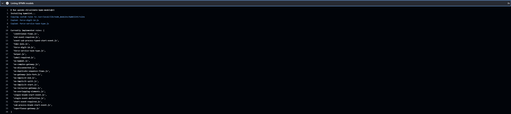
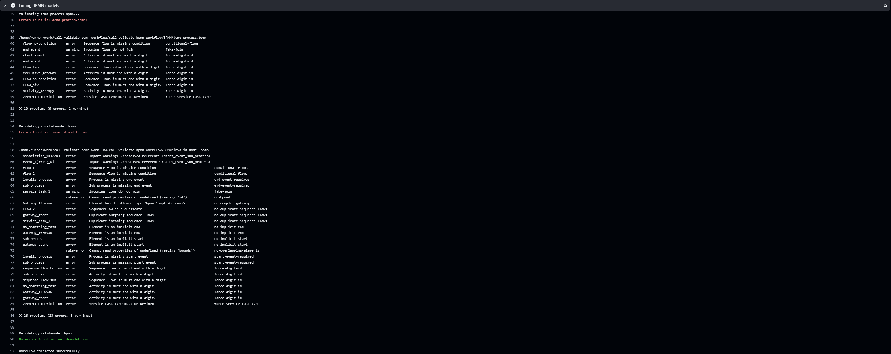

### Description

This GitHub Action workflow is designed to streamline the linting process for BPMN models using the bpmn linter provided by [bpmn-io](https://github.com/bpmn-io). It enables you to lint your BPMN models and incorporate user-defined rules.

### Usage

You can simply refer to this GitHub action in any GitHub workflow.

```yaml
         - name: Linting BPMN models
           uses: apendo-c8/linting-bpmn-models@v1.3
           with:
              bpmn_models_source: 'Location of BPMN models'
              custom-rules-folder: 'Location of custom rules'
```

If you wish to run the workflow without any custom rules simply omit `custom-rules-folder:` 
from the workflow configuration. 


3. **Create a .bpmnlintrc configuration file**
      
   Create a file titled `.bpmnlintrc` in the same directory as your process models.


   Open the file and paste this configuration if you intend to only use the [bpmnlint](https://github.com/bpmn-io/bpmnlint) standard rule set.

```yaml
{
   "extends": "bpmnlint:recommended"
}
```
Use this configuration if you intend to implement any custom rules.
Replace `"your-custom-rule": "error"` with your custom defined rules.
```yaml
{
   "extends": "bpmnlint:recommended",
   "rules": {
      "your-custom-rule-1": "error",
      "your-custom-rule-2": "warning"
   }
}
```
Further information on how to configure bpmnlint can be found here: [bpmn-io](https://github.com/bpmn-io/bpmnlint)

### Run BPMN validation workflow

Navigate to the Actions tab of your repository and click `Validate BPMN process models` found on the left side under Actions. Then click `Run workflow`.

This example workflow utilizes `on: workflow_dispatch` variants and syntax reference can be found [here](https://docs.github.com/en/actions/using-workflows/workflow-syntax-for-github-actions),

### Example output



